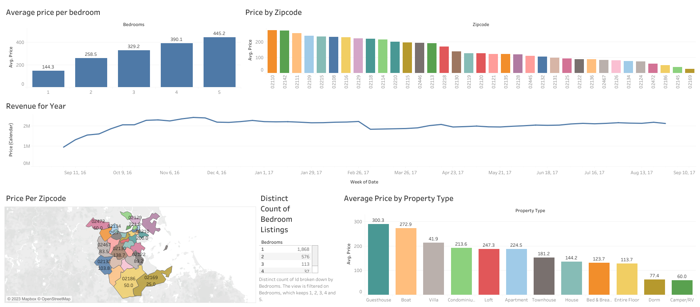

# Boston-Airbnb-Listings-Tableau
<h3> Project Overview </h3>

 Detailed analysis of the Airbnb listings in Boston area. Various types of diagrams were created to analyze relationships between listings, prices, property types, and revenue.

<h4> The following use cases were analyzed: </h4>
<ul>
  <li> Average price difference per bedroom </li>
  <li> Average price difference based on zipcodes as a bar chart</li>
   <li> Total revenue in one year on a line chart </li>
  <li> Average price difference based on zipcodes on a map </li>
  <li> Number of listings based on distinct count of bedrooms</li>
  <li> Average price based on property types </li>
  </ul>

<h3> Dashboard </h3>

 <strong> <i> <a href="https://public.tableau.com/app/profile/purva.patel8557/viz/BostonAirbnbListingsProject/Dashboard1">View interactive dashboard on Tableau </a></i> </strong>
  

  
  
